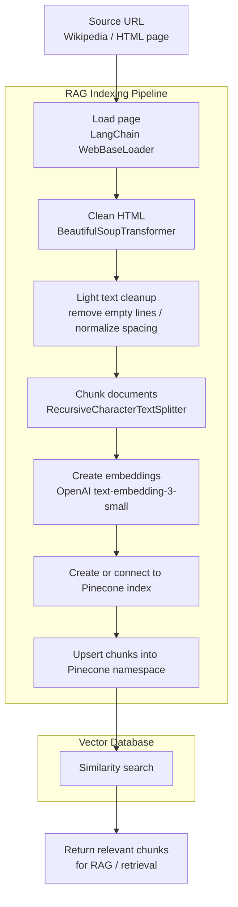

# RAG Indexing Pipeline with Pinecone

This project demonstrates a clean Retrieval-Augmented Generation indexing pipeline using LangChain, OpenAI embeddings, and Pinecone.

The pipeline loads a web page, cleans the HTML, splits the text into chunks, converts those chunks into embeddings, and stores them in Pinecone for semantic search.

## What

This folder contains a minimal indexing pipeline for a RAG system.

It does the following:

1. Loads a source web page.
2. Cleans the HTML and extracts useful article content.
3. Splits the text into smaller chunks.
4. Creates vector embeddings using OpenAI.
5. Stores the vectors in Pinecone.
6. Runs a demo similarity search against the indexed content.

Current example source:

```text
https://en.wikipedia.org/wiki/2023_Cricket_World_Cup
```

Main file:

```text
rag_pinecone_indexing_pipeline.py
```

## Why

This project is part of a RAGOps learning path.

The earlier versions of this lab explored the indexing pipeline step by step:

```text
raw HTML loading
→ HTML-to-text conversion
→ chunking
→ OpenAI embeddings
→ local FAISS vector search
→ managed Pinecone vector database
```

The final version uses Pinecone because it is closer to a production-style vector database than local FAISS.

FAISS is useful for local experiments, notebooks, and quick prototypes.

Pinecone is more suitable when the vector store needs to be managed externally, queried consistently, and separated from the local machine.

In other words:

```text
FAISS    = good local learning/prototyping vector store
Pinecone = managed vector database for more realistic RAG architecture
```

## Architecture




The script will:

1. Create embeddings using OpenAI.
2. Create a Pinecone index if it does not already exist.
3. Load and clean the source page.
4. Split the page into chunks.
5. Upsert the chunks into Pinecone.
6. Run a demo semantic search.

### 4. Configure the pipeline

The main configuration is inside the `RagConfig` dataclass:

```python
@dataclass(frozen=True)
class RagConfig:
    url: str = "https://en.wikipedia.org/wiki/2023_Cricket_World_Cup"

    index_name: str = "cwc-rag-index"
    namespace: str = "wikipedia-2023-cricket-world-cup"

    embedding_model: str = "text-embedding-3-small"

    chunk_size: int = 1000
    chunk_overlap: int = 120

    demo_query: str = "Who won the 2023 Cricket World Cup?"
```

You can change:

* `url` to index a different web page.
* `index_name` to use a different Pinecone index.
* `namespace` to isolate different document collections.
* `chunk_size` and `chunk_overlap` to tune retrieval quality.
* `demo_query` to test different semantic searches.

## Cleanup from earlier versions

The old files were useful learning steps, but they are no longer needed in the final Pinecone-based version.

Remove older experimental files such as:

```text
loader_basic.py
loader_html2text.py
loader_and_fix_chunk.py
rag_indexing_pipeline.py
rag_indexing_pipeline_openai.py
rag_faiss_indexing_pipeline.py
rag_faiss_beautifulsoup_indexing_pipeline.py
chunks.json
embeddings.npy
meta.json
```

The cleaned folder should look like this:

```text
indexing_pipeline/
├── README.md
└── rag_pinecone_indexing_pipeline.py
```

## Notes

This project focuses only on the indexing side of RAG.

It does not yet include:

* a chat interface,
* prompt construction,
* answer generation,
* citation formatting,
* document refresh scheduling,
* evaluation,
* observability,
* or deployment automation.

Those would belong to the next stages of a full RAGOps workflow.
