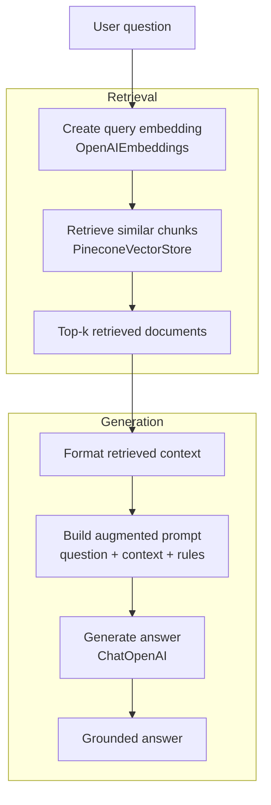

# RAG Generation Pipeline with Pinecone

This folder demonstrates the generation side of a Retrieval-Augmented Generation system.

It retrieves relevant chunks from Pinecone, builds an augmented prompt, and asks an OpenAI chat model to answer using only the retrieved context.

## What

The generation pipeline answers a user question using previously indexed documents.

It does this in four steps:

1. Embed the user question with the same embedding model used during indexing.
2. Retrieve the most relevant chunks from Pinecone.
3. Build a prompt that includes the question and retrieved context.
4. Generate a grounded answer with a chat model.

Main file:

```text
rag_generation_from_pinecone.py
```

This generation pipeline assumes that the `indexing_pipeline` has already populated the Pinecone index.

Default example question:

```text
Who won the 2023 Cricket World Cup?
```

## Why

This folder represents the second half of RAG.

The indexing pipeline prepares the knowledge base:

```text
documents → chunks → embeddings → Pinecone
```

The generation pipeline uses that knowledge base:

```text
question → retrieval → context → prompt → answer
```

This separation is important because retrieval and generation are different responsibilities.

Retrieval finds the relevant information.

Generation reads the retrieved information and synthesizes an answer.

The LLM does not search the vector database by itself. The application retrieves the context first, then passes that context to the LLM.

Earlier files in this folder explored retrieval concepts step by step:

```text
TF-IDF
→ BM25
→ FAISS vector retrieval
→ FAISS-based RAG generation
→ Pinecone-based RAG generation
```

The cleaned version keeps the final Pinecone-based generation pipeline and removes older learning-step scripts.

## Architecture



## Relationship with the indexing pipeline

This generation pipeline depends on the Pinecone index created by the indexing pipeline.

The values below must match between both pipelines:

```python
index_name = "cwc-rag-index"
namespace = "wikipedia-2023-cricket-world-cup"
embedding_model = "text-embedding-3-small"
```

If the generation pipeline uses a different embedding model from the indexing pipeline, retrieval can become incorrect.

If the embedding dimensions differ, the query may fail.

If the dimensions match but the embedding model is different, retrieval may silently return poor results because the semantic geometry is not the same.


The script will:

1. Connect to the existing Pinecone index.
2. Retrieve the top-k chunks for the question.
3. Build a grounded prompt.
4. Generate an answer using the retrieved context.
5. Print the answer and retrieval debug information.

## Configuration

The main configuration is in the `GenerationConfig` dataclass:

```python
@dataclass(frozen=True)
class GenerationConfig:
    index_name: str = "cwc-rag-index"
    namespace: str = "wikipedia-2023-cricket-world-cup"

    embedding_model: str = "text-embedding-3-small"
    chat_model: str = "gpt-4o-mini"

    query: str = "Who won the 2023 Cricket World Cup?"
    top_k: int = 4

    temperature: float = 0.0
    max_retries: int = 2
```

You can change:

- `query` to ask a different question.
- `top_k` to retrieve more or fewer chunks.
- `chat_model` to use a different OpenAI chat model.
- `namespace` to query a different document collection.
- `index_name` to connect to a different Pinecone index.

## Cleanup from earlier versions

The older files were useful learning steps, but they are not needed in the cleaned Pinecone version.

Remove:

```text
faiss_vector_retrieval.py
lexical_bm25.py
lexical_tfidf.py
lexical_tfidf_verbose.py
rag_generation_from_faiss.py
```

The cleaned folder should look like this:

```text
generation_pipeline/
├── README.md
├── requirements.txt
└── rag_generation_from_pinecone.py
```

## Notes

This folder focuses on retrieval plus generation.

It does not yet include:

- chat memory,
- multi-turn conversation,
- streaming output,
- citation formatting,
- evaluation,
- fallback retrieval,
- reranking,
- hybrid retrieval,
- observability,
- or deployment automation.

Those would belong to later RAGOps stages.
